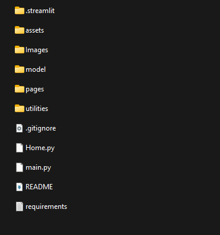

# PixelMaster: Image Annotation Tool
A user-friendly web-based tool to streamline image annotation and labeling processes for the University of Canberra's Human-Centered Technology Research team.

### Preview

### Steps to setup
1. Create a python environment and install all the libraries specified in requirements.txt
2. Download the model and image files files from the given link:
 `https://drive.google.com/file/d/1M8LijnNH1fyTezzJBdsZhw0MKl8Ar80G/view?usp=drive_link`
3. Extract all the files from the downloaded zip file from drive to the root directory of project.
4. After extracting the files the folder structure should be as below:

 
 
5. Run the following command to start the application
`streamlit run Home.py`
